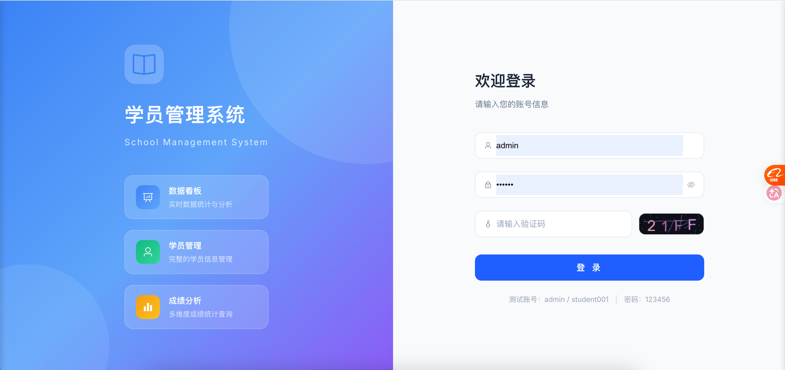
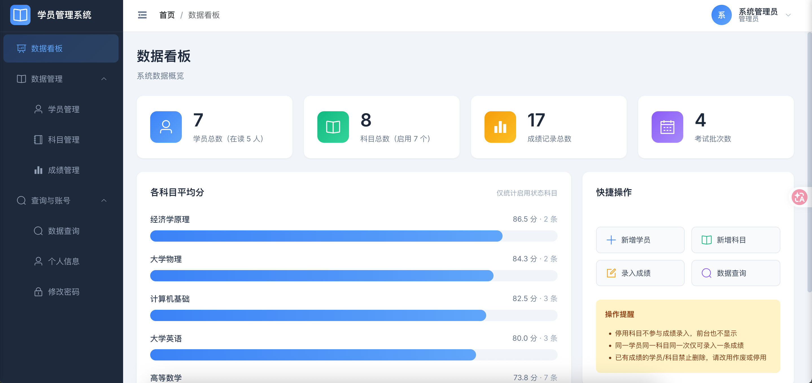
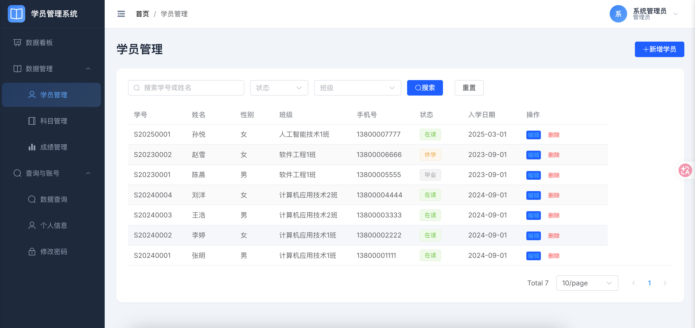
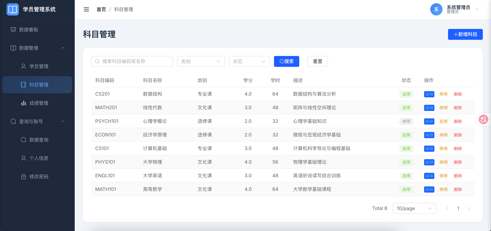
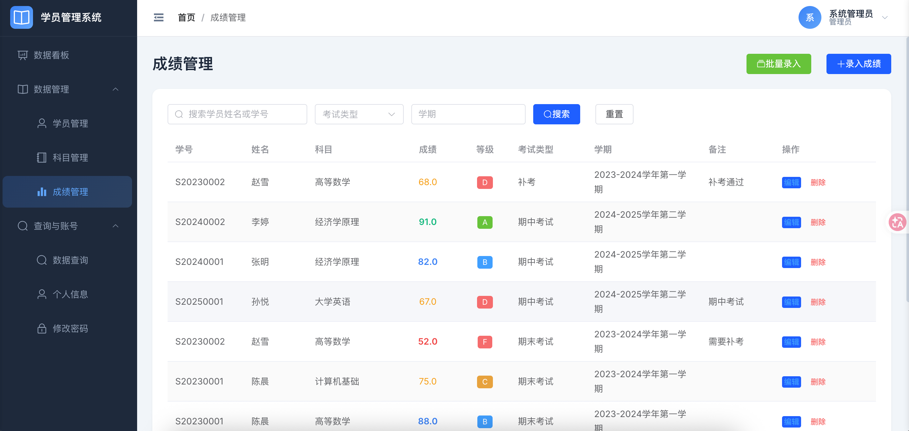
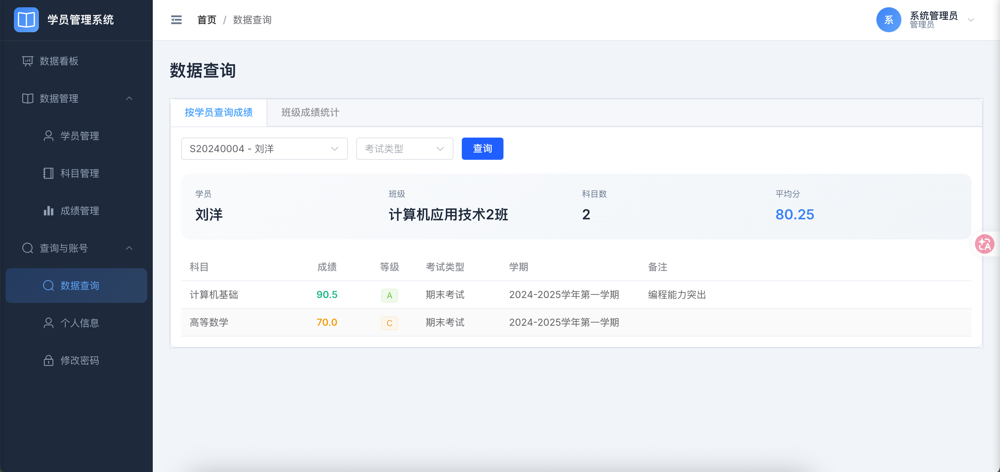
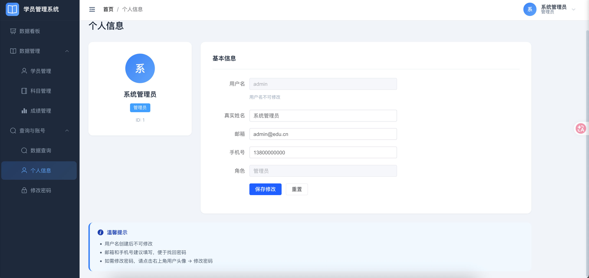

# wyh-ai-coding(校园信息管理系统)

  - 一步一步vibe coding 实现Python3、FastAPI、Vue3 等技术栈前后端分离的学生管理系统的演示项目。
    - [AI代码生成指导文档](docs/AI生成代码.md)
    - [AI文档生成](docs/AI生成文档.md)
  - 基于 FastAPI + Vue 3 + Element Plus 的现代化校园管理系统，提供学员信息、科目、成绩的全生命周期管理，支持多条件查询、数据统计看板、权限控制等功能。

## 目录

- [技术栈](#技术栈)
- [功能特性](#功能特性)
- [项目结构](#项目结构)
- [快速开始](#快速开始)
  - [环境要求](#环境要求)
  - [数据库初始化](#数据库初始化)
  - [后端服务启动](#后端服务启动)
  - [前端服务启动](#前端服务启动)
- [默认账号](#默认账号)
- [文档索引](#文档索引)
- [数据库设计](#数据库设计)
- [常见问题](#常见问题)

---

## 技术栈

### 后端

| 技术 | 版本 | 说明 |
|------|------|------|
| Python | 3.8+ | 编程语言 |
| FastAPI | 0.115.0 | 高性能异步 Web 框架 |
| Uvicorn | 0.30.6 | ASGI 服务器 |
| PyMySQL | 1.1.1 | MySQL 连接器 |
| Pillow | 10.4.0 | 图形验证码生成 |
| Pydantic | latest | 数据校验 |

### 前端

| 技术 | 版本 | 说明 |
|------|------|------|
| Vue 3 | ^3.4.0 | 渐进式 JavaScript 框架 |
| Vite | ^5.2.0 | 前端构建工具 |
| Element Plus | ^2.7.0 | Vue 3 UI 组件库 |
| Pinia | ^2.1.7 | 状态管理 |
| Axios | ^1.7.0 | HTTP 客户端 |
| Vue Router | ^4.3.0 | 路由管理 |
| Sass | ^1.77.0 | CSS 预处理器 |

### 数据库

| 技术 | 版本 | 说明 |
|------|------|------|
| MySQL | 8.0+ | 关系型数据库 |

---

## 功能特性

### 🔐 用户认证

- 账号密码登录 + 图形验证码（Pillow 生成 4 位字符）
- 自实现 JWT Token 鉴权（Base64 载荷 + SHA-256 签名，有效期 24 小时）
- 密码 SHA-256 + 随机盐值加密存储
- 登录状态持久化，路由守卫自动跳转
  


### 📊 数据看板

- 学员总数统计（在读/离校分类）
- 科目总数统计（启用/停用分类）
- 成绩记录总数、独立考试类型数统计
- 科目成绩概览（按科目平均分排序）
- 最近学员动态、最近成绩记录
- 基础数据字典（考试类型、科目类别、班级列表）



### 👨‍🎓 学员管理

- 学员信息 CRUD（增删改查）
- 多条件搜索（关键词、班级、状态）
- 分页查询，默认每页 10 条
- 学号/手机号/身份证号唯一性校验
- 关联成绩时禁止删除（软删除）



### 📚 科目管理

- 科目信息 CRUD
- 类别管理（文化课/专业课/选修课）
- 学分（DECIMAL）、学时配置
- 科目编码、名称唯一性校验
- 启用/停用状态切换
- 关联成绩时禁止删除（物理删除）



### 📝 成绩管理

- 单条成绩录入 + 批量成绩录入
- 学员/科目/考试类型/学期联合唯一性校验
- 成绩等级自动计算（A/B/C/D/F 五级）
- 多条件搜索（学员、科目、考试类型、学期、班级、关键词）
- 成绩修改自动重算等级
- 按科目统计汇总（平均分/最高分/最低分）



### 🔍 数据查询

- 学员成绩多维度筛选查询
- 支持学员、科目、考试类型、班级、学期联合筛选
- 分页展示



### ⚙️ 个人中心

- 个人信息查看与修改（邮箱、手机号格式校验）
- 密码修改（原密码校验 + 长度校验）



### 🎨 UI 设计

- 响应式布局（Element Plus 栅格系统）
- 现代化渐变配色
- 侧边栏折叠/展开
- 侧边栏 + 顶部导航 + 面包屑
- 表格斑马纹、动画过渡效果

---

## 项目结构

```
wyh-ai-coding/
├── backend/                          # 后端服务（FastAPI）
│   ├── config.py                     # 全局配置（数据库、密钥、Token过期时间）
│   ├── database.py                   # 数据库工具类（PyMySQL 上下文管理器）
│   ├── main.py                       # FastAPI 入口（路由注册、CORS、异常处理）
│   ├── requirements.txt              # Python 依赖清单
│   ├── app.log                       # 运行日志
│   ├── routers/                      # 路由模块
│   │   ├── auth.py                   # 认证路由（验证码、登录、登出、用户信息）
│   │   ├── students.py               # 学员管理路由（CRUD）
│   │   ├── subjects.py               # 科目管理路由（CRUD + 全部启用科目）
│   │   ├── scores.py                 # 成绩管理路由（CRUD + 批量 + 统计）
│   │   ├── dashboard.py              # 数据看板路由（统计、枚举、最近记录）
│   │   └── users.py                  # 用户管理路由（个人信息、密码修改）
│   ├── schemas/                      # Pydantic 数据模型
│   │   └── user.py                   # 用户相关 Schema
│   └── utils/                        # 工具模块
│       ├── auth.py                   # JWT 鉴权工具（生成/验证/解析）
│       ├── captcha.py                # 验证码生成 + 密码加密
│       └── response.py               # 统一响应格式工具
├── frontend/                         # 前端项目（Vue 3）
│   ├── node_modules/                 # 依赖包
│   ├── index.html                    # HTML 入口
│   ├── package.json                  # NPM 依赖清单
│   └── vite.config.js                # Vite 配置
├── docs/                             # 文档目录
│   ├── PRD/                          # 产品需求文档
│   │   ├── 00-PRD总览.md
│   │   ├── 01-登录模块.md
│   │   ├── 02-首页模块.md
│   │   ├── 03-数据看板.md
│   │   ├── 04-学员管理.md
│   │   ├── 05-科目管理.md
│   │   ├── 06-成绩管理.md
│   │   ├── 07-数据查询.md
│   │   └── 08-个人信息与密码.md
│   ├── 项目功能清单列表.md
│   ├── 接口设计文档.md
│   ├── TODO list 任务清单.md
│   └── init.sql                      # 数据库初始化脚本
├── README.md                         # 项目说明文档
└── debug_start.sh                    # 环境诊断脚本
```

---

## 快速开始

### 环境要求

| 软件 | 版本要求 |
|------|----------|
| Python | 3.8+ |
| Node.js | 16+ |
| MySQL | 8.0+ |
| pip | 最新版 |
| npm | 最新版 |

### 数据库初始化

```bash
# 登录 MySQL
mysql -u root -p

# 执行初始化脚本（创建数据库 + 表结构 + 测试数据）
source /path/to/wyh-ai-coding/docs/init.sql
```

初始化脚本包含：
- 创建数据库 `student_management`
- 创建 4 张数据表（user、student、subject、score）+ 1 个视图
- 插入测试数据（2 个用户、8 个科目、7 名学员、21 条成绩）

### 后端服务启动

```bash
# 进入后端目录
cd wyh-ai-coding/backend

# 安装依赖
pip install -r requirements.txt

# 启动服务（开发模式，端口 8000）
python main.py
```

启动成功后访问：
- API 根路径：`http://localhost:8000/`
- 健康检查：`http://localhost:8000/health`
- 接口文档（需配置）：`http://localhost:8000/docs`

> **注意**：数据库配置在 `backend/config.py` 中，默认连接 `localhost:3306`，用户 `xxx`，密码 `xxx`。生产环境建议通过环境变量配置 `DB_CONFIG` 和 `SECRET_KEY`。

### 前端服务启动

```bash
# 进入前端目录
cd wyh-ai-coding/frontend

# 安装依赖
npm install

# 启动开发服务器（端口 5173）
npm run dev

# 或生产构建
npm run build
```

启动成功后访问：`http://localhost:5173`

### 环境诊断

项目提供了环境诊断脚本，可检查各依赖和端口占用情况：

```bash
# 运行诊断
bash debug_start.sh
```

---

## 默认账号

| 角色 | 用户名 | 密码 | 说明 |
|------|--------|------|------|
| 管理员（admin） | admin | 123456 | 拥有全部管理权限 |
| 学员（student） | student001 | 123456 | 可登录查看个人信息 |

---

## 文档索引

| 文档 | 路径 | 说明 |
|------|------|------|
| 项目功能清单 | [docs/项目功能清单列表.md](docs/项目功能清单列表.md) | 系统所有功能层级清单 |
| 接口设计文档 | [docs/接口设计文档.md](docs/接口设计文档.md) | 34 个 API 接口详细定义 |
| PRD 总览 | [docs/PRD/00-PRD总览.md](docs/PRD/00-PRD总览.md) | 项目概述、权限矩阵、业务流程 |
| PRD - 登录模块 | [docs/PRD/01-登录模块.md](docs/PRD/01-登录模块.md) | 登录功能详细需求 |
| PRD - 首页模块 | [docs/PRD/02-首页模块.md](docs/PRD/02-首页模块.md) | 首页功能详细需求 |
| PRD - 数据看板 | [docs/PRD/03-数据看板.md](docs/PRD/03-数据看板.md) | 数据看板详细需求 |
| PRD - 学员管理 | [docs/PRD/04-学员管理.md](docs/PRD/04-学员管理.md) | 学员管理详细需求 |
| PRD - 科目管理 | [docs/PRD/05-科目管理.md](docs/PRD/05-科目管理.md) | 科目管理详细需求 |
| PRD - 成绩管理 | [docs/PRD/06-成绩管理.md](docs/PRD/06-成绩管理.md) | 成绩管理详细需求 |
| PRD - 数据查询 | [docs/PRD/07-数据查询.md](docs/PRD/07-数据查询.md) | 数据查询详细需求 |
| PRD - 个人信息 | [docs/PRD/08-个人信息与密码.md](docs/PRD/08-个人信息与密码.md) | 个人信息与密码详细需求 |
| TODO 任务清单 | [docs/TODO list 任务清单.md](docs/TODO%20list%20任务清单.md) | 165 项开发任务清单 |
| 数据库脚本 | [docs/init.sql](docs/init.sql) | 数据库初始化脚本 |

---

## 数据库设计

### 数据表结构

| 表名 | 说明 | 关键字段 |
|------|------|----------|
| user | 系统用户表 | id, username(唯一), password, role, status |
| student | 学员信息表 | id, student_no(唯一), phone(唯一), id_card(唯一), 逻辑删除 |
| subject | 科目信息表 | id, subject_code(唯一), subject_name(唯一), status |
| score | 学员成绩表 | id, student_id(外键), subject_id(外键), score_value, grade_level |

### 数据实体关系

```
用户(user) ──1:N──→ 学员(student)     [通过 username 关联]

学员(student) ──1:N──→ 成绩(score)
                           │
                           └──N:1──→ 科目(subject)
```

### 唯一约束

| 表 | 字段 | 说明 |
|----|------|------|
| user | username | 用户名唯一 |
| student | student_no | 学号唯一 |
| student | phone | 手机号唯一 |
| student | id_card | 身份证号唯一 |
| subject | subject_code | 科目编码唯一 |
| subject | subject_name | 科目名称唯一 |
| score | student_id + subject_id + exam_type + term | 联合唯一 |

### 初始数据

| 数据类型 | 数量 | 说明 |
|----------|------|------|
| 用户 | 2 | admin（管理员）、student001（学员） |
| 科目 | 8 | 涵盖文化课、专业课、选修课 |
| 学员 | 7 | 不同班级、不同状态 |
| 成绩 | 21 | 覆盖期中/期末/补考等类型 |

---

## 常见问题

### Q: 启动后端报数据库连接错误？

请检查：
1. MySQL 服务是否已启动
2. `backend/config.py` 中的数据库配置是否正确
3. 数据库 `student_management` 是否已创建

```bash
# 测试数据库连接
mysql -u root -p -e "SELECT 1"
```

### Q: 前端启动后页面空白？

请检查：
1. 后端服务是否已启动
2. `vite.config.js` 中的 API 代理配置是否指向正确的后端地址
3. 浏览器控制台是否有错误信息

### Q: Token 过期怎么办？

Token 有效期为 24 小时。过期后：
1. 前端会自动跳转到登录页
2. 清除本地存储的 Token
3. 需要重新登录获取新 Token

### Q: 如何修改数据库配置？

编辑 `backend/config.py`：

```python
DB_CONFIG = {
    'host': 'localhost',
    'port': 3306,
    'user': 'root',
    'password': 'your_password',
    'database': 'student_management',
    'charset': 'utf8mb4',
}
```

或通过环境变量覆盖：
```bash
export DB_PASSWORD='your_password'
export SECRET_KEY='your_secret_key'
```

### Q: 如何重置测试数据？

重新执行 `docs/init.sql` 脚本即可重置所有数据。注意该脚本会先删除后重建所有表。

---

## 技术说明

### 统一响应格式

所有接口遵循统一响应结构：

```json
{
  "code": 200,
  "msg": "success",
  "data": {}
}
```

### 错误码说明

| 业务码 | 说明 |
|--------|------|
| 200 | 成功 |
| 400 | 请求参数错误 |
| 401 | 未登录或 Token 失效 |
| 404 | 资源不存在 |
| 500 | 服务器内部错误 |

### 认证方式

- 无需认证的接口：登录、验证码、健康检查
- 需认证的接口：请求头携带 `Authorization: Bearer {token}`
- Token 有效期：24 小时
- Token 格式：`Base64(载荷).SHA-256(签名)`

---

*本文档基于项目源码和文档综合编写，版本 v1.0.0*